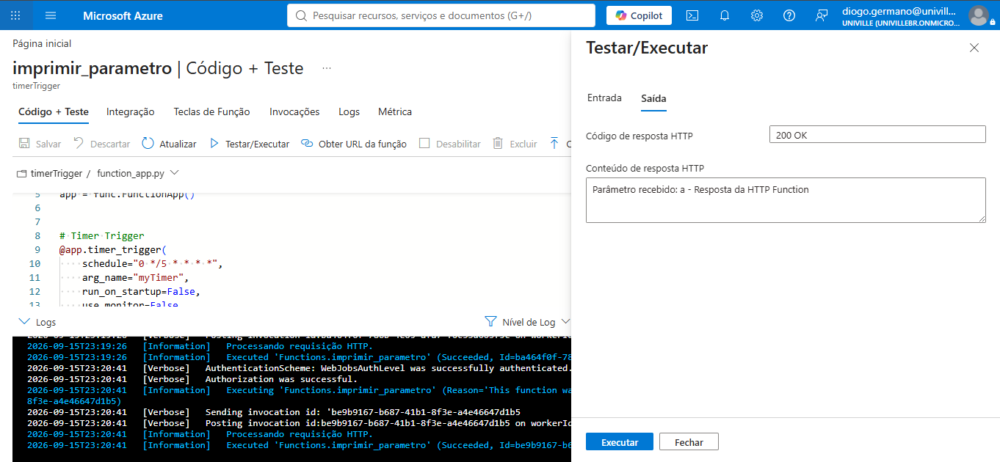
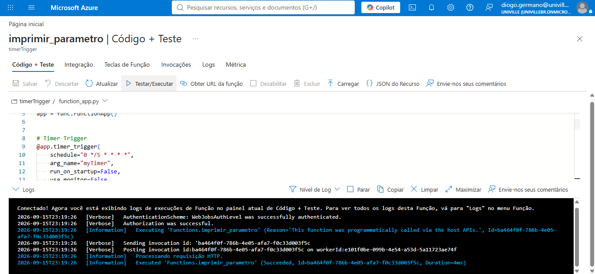
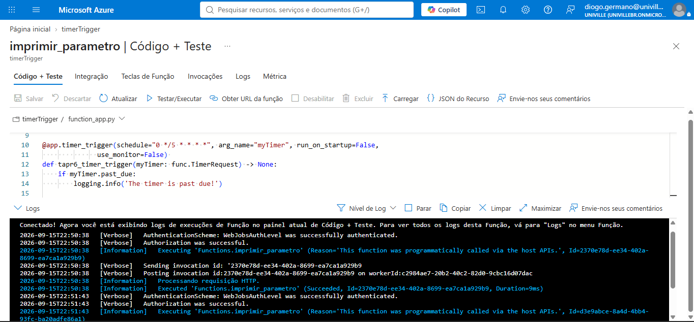
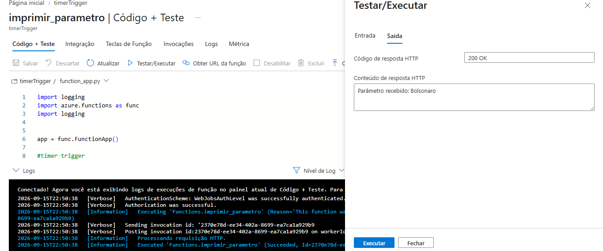
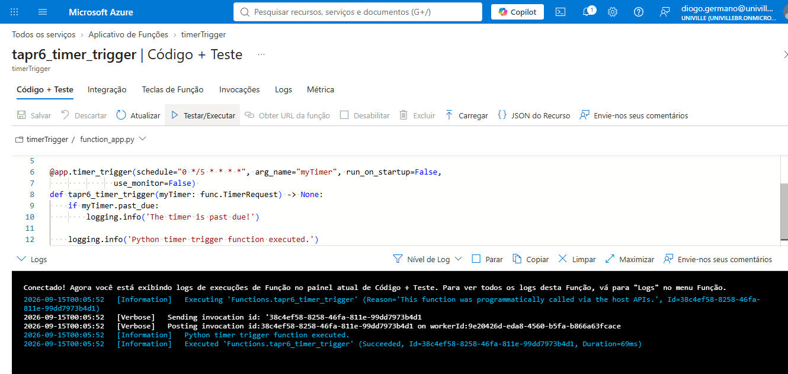
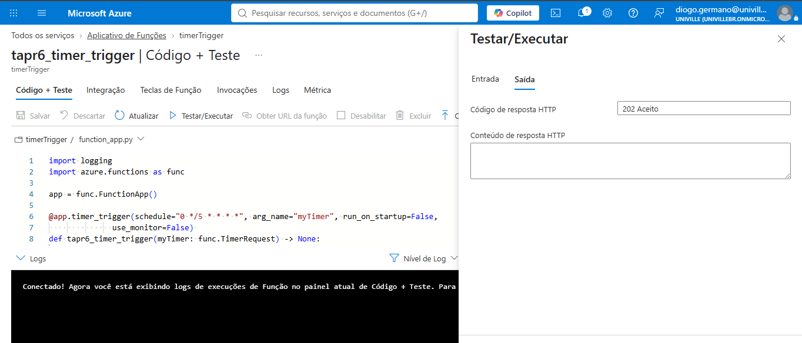

# Projeto Azure Functions

**Disciplina:** Tópicos Avançados em Programação - Univille  
**Alunos:** Diogo Soares Germano e Leticia S C Germano  

---

## Demonstração das Execuções e Testes

### 1. http and timer trigger - resposta 

---

### 2. http and timer trigger - log

---

### 3. http trigger - log

---

### 4. http trigger - resposta

---

### 5. timer trigger - log

---

### 6. timer trigger - resposta

